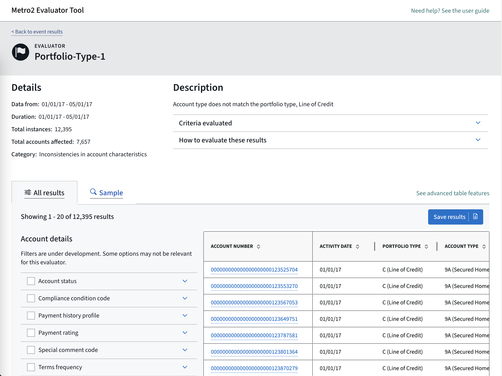

# Overview
CFPB’s Metro2 Evaluator Tool (M2) evaluates Metro2 data for inaccuracies which may prove harmful to consumers’ credit.

The application has a Django back-end which connects to a Postgres database. The back end fetches Metro2 data files from an S3 bucket, parses the relevant data into the database, and runs evaluators on the data. The back end also handles authorization for users and provides API endpoints to expose the evaluated data to the front end. The front-end provides a React-based interface for authenticated and authorized users and allows them to interact with the data.

## Sections
- [Running the project locally](#running-the-project-locally)
    - [Running in docker-compose](#running-in-docker-compose)
- [Management commands](#running-management-commands)
- [Handling evaluator metadata](#handling-evaluator-metadata)
- [Testing](#testing)
  - [Running tests and checking coverage](#running-tests-and-checking-coverage)

# Running the project locally
**Docker-compose** is best way to run Metro2 for local development. It allows dynamically reloading code while still providing all parts of the project setup.

It is also possible to run some of the sub-projects **locally**, but this is usually only practical for active development on a specific aspect of the codebase.

## Running in docker-compose
If docker desktop is not already installed, please [download and install it](https://www.docker.com/products/docker-desktop/).

`docker compose build` to build the images.

`docker compose up` or `docker compose up -d` to run the application.

The front end is served by Vite in development mode at http://localhost:3000. The Django app runs on port 8000 and the admin can be accessed at http://localhost:8000/admin/.

To connect to a running container, (e.g. to run scripts or tests), `docker compose exec [container-name] sh`, where `[container-name]` is one of the services named in [docker-compose.yml](/docker-compose.yml), i.e. `django` or `frontend`.

To bring down the created containers when you are done with them, run `docker compose down`. To also remove volumes at the same time, run `docker compose down -v`. To remove images in addition to volumes, run `docker compose down --rmi "all" -v`.

## Individual jobs
Both the **Django** and **Front-end** code bases can be run locally. See the README for each subdirectory for instructions.

# Running management commands
Django management commands are used for several essential actions in the Metro2 application, including parsing new data, running evaluators, and importing evaluator metadata from CSV.
To see the full list of available management commands, run `python manage.py help` from the django directory.
In local environments, use the command line to run these commands.

# Testing

## Running tests and checking coverage
**For the Django code:**

1. Connect to the Django container: while the docker-compose setup is running, `docker compose exec django sh`
2. Run the tests: once connected to the container, run `coverage run ./manage.py test`
2. Check test coverage: `coverage report` or `coverage html`

**For the Front-end code:**

1. Install any front-end dependencies listed in [front-end/README.md](/front-end/README.md)
2. Run linting and tests: From the `/front-end` directory, run `yarn validate`
